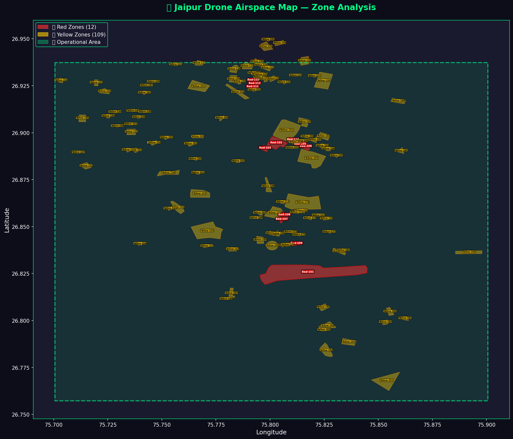
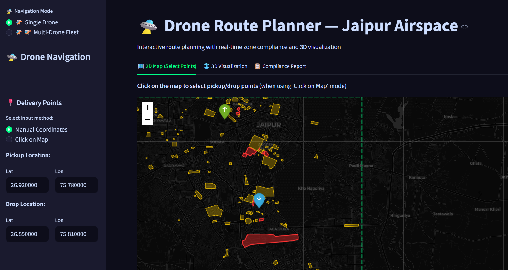
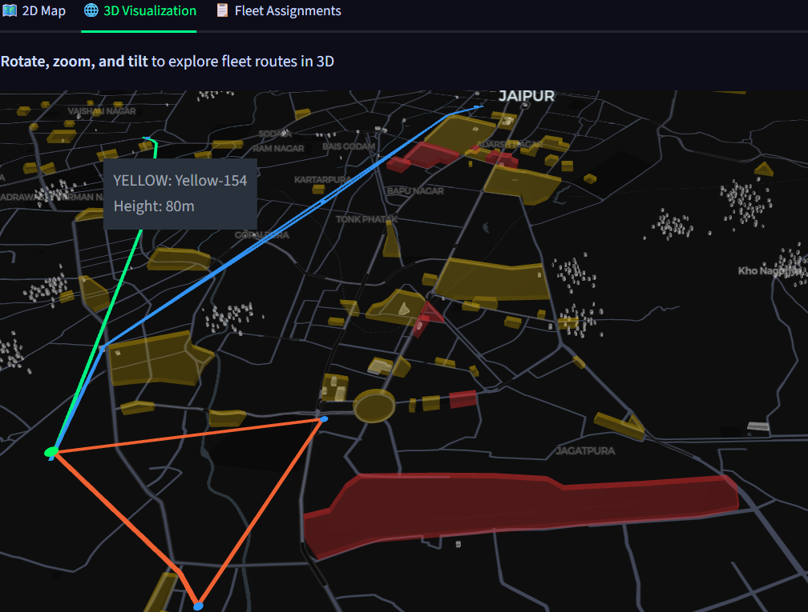
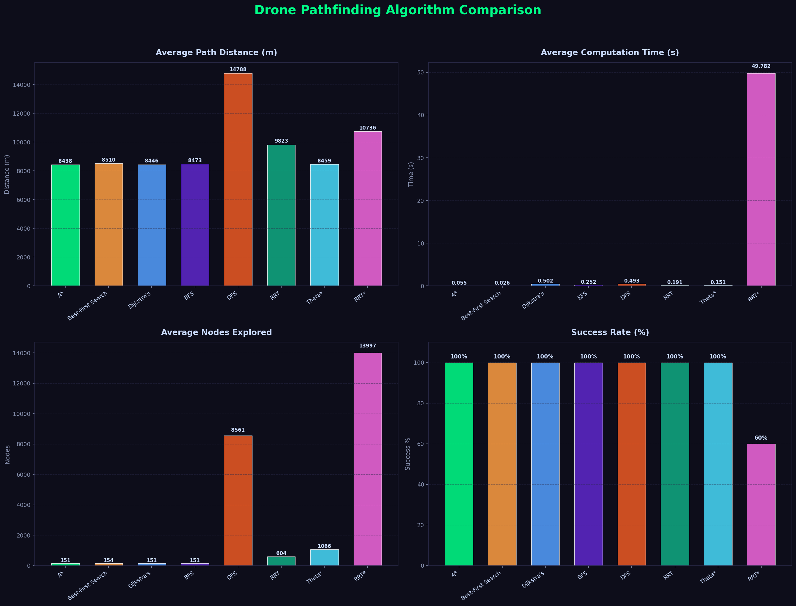

# 🚁 AI-Based Drone Delivery System

**Intelligent Drone Navigation and Fleet Optimization for Last-Mile Delivery in Regulated Indian Airspace**

An end-to-end drone delivery route planning system built for the city of **Jaipur, Rajasthan**. The system computes safe, regulation-compliant flight paths that avoid no-fly zones, restricted areas, and buildings — then optimizes multi-drone fleet assignments using Google OR-Tools.

🔗 **Live Demo:** [Hugging Face Spaces](https://huggingface.co/spaces/Pkf12341/drone-route-planner)

---

## 📌 Table of Contents

- [Features](#-features)
- [System Architecture](#-system-architecture)
- [Pipeline Steps](#-pipeline-steps-1-8)
- [Pathfinding Algorithms](#-pathfinding-algorithms)
- [Project Structure](#-project-structure)
- [Installation](#-installation)
- [Usage](#-usage)
- [Algorithm Comparison](#-algorithm-comparison-results)
- [Tech Stack](#-tech-stack)
- [Team](#-team)

---

## ✨ Features

- 🗺️ **Geospatial Airspace Modelling** — Red (no-fly) and Yellow (conditional) zone classification based on DGCA-style rules
  
  

- 🏢 **Building Obstacle Mapping** — Real OSM buildings + 1,000 simulated structures with height data
- 🧠 **5 Pathfinding Algorithms** — A*, Best-First Search, BFS, Theta*, RRT*
- ✂️ **Path Smoothing** — String-pulling reduces 150+ waypoints to 4-8 smooth flight vectors
- 🚁 **Multi-Drone Fleet Optimization** — Google OR-Tools VRP solver with capacity and battery constraints
- 🌐 **Interactive Dashboard** — Streamlit app with 2D (Folium) and 3D (PyDeck) map visualization
- ☁️ **Cloud Deployed** — Runs on Hugging Face Spaces, accessible via browser — no installation needed

---

## 🏗️ System Architecture

```
┌──────────────────────────────────────────────────────────────────┐
│                        DATA PIPELINE                             │
│                                                                  │
│  Step 1          Step 2           Step 3          Step 4         │
│  Analyze Map ──► Fetch OSM    ──► Simulate    ──► Merge Master  │
│  (GeoJSON)       Buildings        Buildings       Map (GeoJSON)  │
└──────────────────────────┬───────────────────────────────────────┘
                           │
                           ▼
┌──────────────────────────────────────────────────────────────────┐
│                     NAVIGATION ENGINE                            │
│                                                                  │
│  Step 5                    Step 6                                │
│  Multi-Algo Pathfinder ──► Single Drone Dashboard               │
│  (A*, BFS, Theta*, etc.)   (2D + 3D Maps)                      │
└──────────────────────────┬───────────────────────────────────────┘
                           │
                           ▼
┌──────────────────────────────────────────────────────────────────┐
│                      FLEET MODULE                                │
│                                                                  │
│  Step 7                    Step 8                                │
│  Fleet Optimizer       ──► Fleet Dashboard                      │
│  (OR-Tools VRP)            (Multi-Drone Viz)                    │
└──────────────────────────────────────────────────────────────────┘
```

---

## 📋 Pipeline Steps (1-8)

### Step 1: Map Analysis (`src/step1_analyze_map.py`)
Reads the custom `data/map.geojson` file containing Jaipur's airspace classification:
- **Red Zones (12):** Airports, military bases, government buildings — completely blocked
- **Yellow Zones (109):** Hospitals, schools, religious sites — conditionally blocked (operator permission needed)
- **Boundary:** 20×20 km operational area centered on Jaipur

### Step 2: Fetch Buildings (`src/step2_fetch_buildings.py`)
Downloads real building footprints from **OpenStreetMap** using the OSMnx library. These provide actual ground-truth obstacle data for the Jaipur region.

### Step 3: Simulate Buildings (`src/step3_simulate_buildings.py`)
Generates ~1,000 additional simulated buildings using:
- **Gaussian-clustered** spatial distribution
- **Truncated normal** height distribution: mean=45m, range=[30, 60]m
- **18m minimum gap** between buildings

### Step 4: Merge Master Map (`src/step4_merge_master.py`)
Combines all zone polygons (Red + Yellow) and all buildings (OSM + simulated) into a single `output/jaipur_master_map.geojson` with height attributes.

### Step 5: Pathfinding Engine (`src/step5_pathfinder.py`)
The core navigation brain. Discretizes the 20×20 km area into a **401×400 grid** (~50m per cell). Each cell is marked blocked or free based on zone type and building height vs. drone altitude.

Implements **5 algorithms** (see details below). All grid-based paths go through **string-pulling** post-processing for smooth flight vectors.

### Step 6: Single Drone Dashboard (`src/step6_dashboard.py`)
Interactive Streamlit interface for planning a single drone delivery:


- Enter pickup (warehouse) and drop coordinates manually or click on the map
- Select pathfinding algorithm
- Configure drone altitude, speed, safety margins
- View computed path on **2D Folium** and **3D PyDeck** maps
- See distance, time, detour ratio, and compliance metrics

### Step 7: Fleet Optimizer (`src/step7_fleet_optimizer.py`)
Solves the **Capacitated Vehicle Routing Problem (CVRP)** using Google OR-Tools:
- Builds a cost matrix using A* safe-path distances between all location pairs
- Minimizes total fleet distance under payload and battery constraints
- Uses PATH_CHEAPEST_ARC + GUIDED_LOCAL_SEARCH with a 10-second time limit

### Step 8: Fleet Dashboard (`src/step8_fleet_dashboard.py`)
Multi-drone fleet management interface:


- Define 1 warehouse + multiple delivery drop points with weights
- Configure fleet size, drone capacity, and battery parameters
- View per-drone route assignments with color-coded paths
- See cost matrix, battery usage, and fleet-level statistics

---

## 🧠 Pathfinding Algorithms

| # | Algorithm | How It Works | Strengths | Weaknesses |
|---|-----------|-------------|-----------|------------|
| 1 | **A*** | Uses `f(n) = g(n) + h(n)` — combines path cost and heuristic | Optimal paths, fast (51ms) | Slightly slower than Best-First |
| 2 | **Best-First Search** | Uses `f(n) = h(n)` — only heuristic, ignores path cost | Fastest (19ms) | Paths may not be optimal |
| 3 | **BFS** | Level-order expansion, FIFO queue | Guarantees fewest-hop path | Slow (296ms), no heuristic |
| 4 | **Theta*** | Extends A* with line-of-sight checks for any-angle paths | Smooth paths natively | More nodes explored (1,066) |
| 5 | **RRT*** | Random sampling + tree rewiring for asymptotic optimality | Works in continuous spaces | Very slow (48.8s), 60% success |

**Heuristic Used:** Octile distance for 8-directional grid movement:
```
h(n) = max(Δx, Δy) + (√2 - 1) × min(Δx, Δy)
```

---

## 📁 Project Structure

```
Drone_project/
│
├── app.py                          # Main entry point (mode selector)
├── Dockerfile                      # Docker config for HF Spaces deployment
├── requirements.txt                # Python dependencies
├── README.md                       # This file
├── Project_Proposal (1).pdf        # Initial project proposal
│
├── .streamlit/
│   └── config.toml                 # Dark theme configuration
│
├── data/
│   └── map.geojson                 # Jaipur airspace zones (Red/Yellow/Boundary)
│
├── output/
│   ├── jaipur_master_map.geojson   # Combined zones + buildings (master obstacle map)
│   ├── buildings_raw.geojson       # Real OSM building footprints
│   ├── buildings_simulated.geojson # Simulated building data
│   ├── algorithm_comparison.csv    # Benchmark results table
│   ├── comparison_path_distance.png
│   ├── comparison_computation_time.png
│   ├── comparison_nodes_explored.png
│   ├── comparison_success_rate.png
│   ├── algorithm_comparison.png    # Combined comparison chart
│   ├── zone_analysis_map.png       # Zone classification visualization
│   ├── mission_path.csv            # Last computed path data
│   └── mission_path.geojson        # Last computed path geometry
│
├── report/
│   ├── drone_project_report.tex    # IEEE-format LaTeX research paper
│   ├── drone_presentation.tex      # LaTeX presentation slides
│   ├── Dashboard.png               # Dashboard screenshot
│   ├── 3D_Map.png                  # 3D visualization screenshot
│   └── comparison_*.png            # Algorithm comparison charts
│
└── src/
    ├── __init__.py                 # Package initializer
    ├── step1_analyze_map.py        # Zone analysis and classification
    ├── step2_fetch_buildings.py    # OSM building data fetcher
    ├── step3_simulate_buildings.py # Procedural building generator
    ├── step4_merge_master.py       # Master map merger
    ├── step5_pathfinder.py         # Multi-algorithm pathfinding engine
    ├── step6_dashboard.py          # Single drone Streamlit dashboard
    ├── step7_fleet_optimizer.py    # OR-Tools VRP fleet optimizer
    ├── step8_fleet_dashboard.py    # Multi-drone fleet dashboard
    └── model_comparison.py         # Algorithm benchmarking script
```

---

## ⚙️ Installation

### Prerequisites
- Python 3.11+
- pip

### Setup
```bash
# Clone the repository
git clone https://github.com/pradeepxkumar/AI-Based-Drone-Delivery-System.git
cd AI-Based-Drone-Delivery-System

# Install dependencies
pip install -r requirements.txt

# Run the dashboard
streamlit run app.py
```

The app opens at `http://localhost:8501` with two modes:
- 🚁 **Single Drone** — plan one delivery route
- 🚁🚁 **Multi-Drone Fleet** — optimize multiple deliveries

### Regenerate Data (Optional)
```bash
# Run the data pipeline (Steps 1-4)
python src/step1_analyze_map.py
python src/step2_fetch_buildings.py
python src/step3_simulate_buildings.py
python src/step4_merge_master.py

# Run algorithm benchmarks
python src/model_comparison.py
```

---

## 📊 Algorithm Comparison Results

Benchmarked across 5 diverse scenarios (3 drones, 5 delivery points, 1 warehouse):



| Algorithm | Success Rate | Avg Distance | Avg Time | Nodes Explored |
|-----------|:----------:|:------------:|:--------:|:--------------:|
| **A*** | **5/5** | **8,438 m** | **0.051 s** | **151** |
| Best-First | 5/5 | 8,510 m | 0.019 s | 154 |
| BFS | 5/5 | 8,473 m | 0.296 s | 151 |
| Theta* | 5/5 | 8,459 m | 0.173 s | 1,066 |
| RRT* | 3/5 | 10,736 m | 48.84 s | 13,997 |

**Key Findings:**
- ✅ **A*** is the recommended default — best balance of speed and path quality
- ⚡ **Best-First** is fastest (19ms) when minor path sub-optimality is acceptable
- 🔄 **BFS** is the reliability baseline but 6× slower than A*
- 📐 **Theta*** produces the smoothest paths natively (no post-processing needed)
- ⚠️ **RRT*** is too slow for real-time use but useful for continuous 3D spaces

---

## 🛠️ Tech Stack

| Component | Technology |
|-----------|-----------|
| Language | Python 3.11 |
| Dashboard | Streamlit |
| 2D Maps | Folium (Leaflet.js) |
| 3D Maps | PyDeck (Deck.gl) |
| GIS Processing | GeoPandas, Shapely |
| Building Data | OSMnx (OpenStreetMap) |
| Fleet Optimization | Google OR-Tools 9.10 |
| Spatial Math | NumPy, SciPy |
| Deployment | Docker, Hugging Face Spaces |

---

## 👥 Team

| Name | Role |
|------|------|
| **Dr. Vipul Kumar Mishra** | Project Guide (Associate Professor) |
| **Aditya Acharya** | B.Tech AI&DS |
| **Harphool Singh** | B.Tech AI&DS |
| **Pradeep Kumar** | B.Tech AI&DS |
| **Vishvendra** | B.Tech AI&DS |

**Institution:** Gati Shakti Vishwavidyalaya, Vadodara, India

---

## 📜 License

This project is licensed under the MIT License.
